# Warum Gale-Shapley´s Deferred Acceptance Mechanismus?
{: .no_toc }
In diesem Kapitel stellen wir das Zuteilungsverfahren (Mechanismus) vor, welches der Kitaplatz-Vergabe respektive der Software KITAMATCH zugrunde liegt.  Das heisst, wir beschreiben wie basierend auf dem Kriterienkatalog (Prioritäten) auf Seite der Kitas und der Präferenzen der Eltern eine Zuteilung von Kindern auf die Verfügbaren Kitaplätze ermittelt wird. 
In [Unterkapitel 1.3.1](#der-deferred-acceptance-mechanismus) wird das Zuteilungsverfahren — der Deferred Acceptance Mechanismus — zusammen mit wichtigen Begrifflichkeiten beschrieben und definiert. [Unterkapitel 1.3.2](#semi-dezentraler-deferred-acceptance-mechanismus-für-kitamatch) beschreibt, wie das Verfahren für die Kitaplatzvergabe angepasst wird, damit Kitas die Möglichkeit haben, in besonderen Fällen vom Kriterienkatalog abzuweichen: Der Semi-Dezentrale Deferred Acceptance Mechanismus. Im [Unterkapitel 1.3.3](#stabilität-und-strategie-sicherheit) werden die Vorteile des Deferred Acceptance Mechanismus beschrieben und definiert: Strategie-Sicherheit und Stabilität. 
Für das praktische Verständnis wird im [Unterkapitel 1.3.4](#beispiele-deferred-acceptance-first-preference-first-und-unkoordiniert) der Deferred Acceptance Mechanismus anhand eines Beispiels beschrieben und mit zwei herkömmlichen Zuteilungsverfahren verglichen: Dem First-Preference-First Mechanismus und der Unkoordinierten Vergabe. Hierbei wird aufgezeigt, dass die herkömmlichen Zuteilungsverfahren weder Strategie-Sicher noch Stabil sind.
Abschließend werden im [Unterkapitel 1.3.5](#wo-sind-die-grenzen-des-algorithmussystems) potenzielle Limitationen und Grenzen von Vergabeverfahren in der Kitaplatzvergabe diskutiert. Hier wird auch aufgezeigt, welche Vorteile ein semi-dezentrales Deferred Acceptance Mechanismus gegenüber einem zentralisierten Deferred Acceptance Mechanismus aufweist. 

## Inhalt
{: .no_toc .text-delta }

1. TOC
{:toc}

---

Der Deferred Acceptance Mechanismus ist ein von David Gale und Loyed Shapley entwickeltes Zuteilungsverfahren, welches 1962 im Journal ,,American Mathematics Monthly” erschienen ist (Gale and Shapley, 1962). Die Autoren beschrieben, wie mit Hilfe des Deferred Acceptance Mechanismus eine stabile Zuteilung von Schülern auf Schulen erreicht werden kann.
Das ZEW hat in Kooperation mit dem deutschen Städtetag, dem Landesjugendamt Baden-Württemberg und mehreren Kommunen in Nordrhein-Westfalen und Rheinland-Pfalz den Deferred Acceptance Mechanismus unter Berücksichtigung von praktischen Problemen auf die koordinierte Vergabe von Kitaplätzen angepasst.
An dieser Stelle werden die grundsätzliche Funktionsweise des Deferred Acceptance Mechansimus, seine Merkmale und Stärken beschrieben. Anschließend  wird die Theory anhand von stilisierten Beispielen verdeutlicht und mit zwei alternativen, in der Praxis verwendeten Verfahren kontrastiert.

Außerdem werden potenzielle Limitationen des Deferred Acceptance Mechanismums, im Kontext der Kitavergabe, diskutiert. Zusätzlich wird jeweils beschrieben, wie diese Probleme in der praktischen Implementierung mitigiert werden können.

---

## Der Deferred Acceptance Mechanismus

An dieser Stelle beschreiben wir den Deferred Acceptance Mechanismus in seiner grundlegenden Art — ohne zusätzliche Anpassungen --- erklärt. Grundsätzlich lässt sich der Mechanismus  relativ einfach auf komplexere Situationen — zum Beispiel Kitas mit unterschiedlichen Betreuungsplätzen bedingt durch heterogene Betreuungsumfänge und Alterskategorien — anpassen.
Der Deferred Acceptance Mechanismus dient der Koordination von Präferenzen und Prioritäten von:

- **Bewerbern**: 

  Eltern/Familien, die Betreuungsplätze für ihre Kinder suchen, werden von nun an als „Bewerber“ bezeichnet.

- **Kitas**:

  Kitaleitungen und FB KTP, welche Betreuungsplätze anbieten, werden von nun an als „Kitas“ bezeichnet. 
 
Für das Funktionieren des Mechanismus werden deshalb drei Angaben der Beteiligten benötigt --- eine auf Seiten der Bewerber und zwei auf Seiten der Kitas:
 
- Für jeden Bewerber ein **Ranking  über die Kitas**:

  Rankings von Bewerbern über Kitas geben Auskunft über die Präferenzen der Bewerber. Die erste angegebene Wahl benennt die ,,Lieblingskita” des Bewerbers, die zweite Wahl die zweitbeste Kita aus der Sicht der Bewerbers, und so weiter und so fort. 
  
  **Wichtig für Bewerber**: 
  
  **A)** Falls ein Bewerber eine oder mehrere Kitas nicht auflistet, können diese Kitas diesem Bewerber während der Vergabe nicht zugeteilt werden. 
  
  **B)** Eine ehrliche Angabe der Präferenzen/Rankings ist im besten Interesse aller Bewerber — ein wichtiger Vorteil des Deferred Acceptance Mechanismus gegenüber anderer Verteilungsverfahren.
 
 
- Für jede Kita eine **Priorität  über die Bewerber**:

    Prioritäten der Kitas bilden das Gegenstück zu den Rankings der Bewerber. Je höher die Priorität eines Bewerbers/Kindes an einer bestimmten Kita, desto besser seine Chancen in dieser Kita einen Platz zu bekommen. Zum Beispiel, wenn eine Kita nur einen Platz für mehrere Bewerber hat, dann erhält das Kind mit der höchsten Priorität (= höchsten Punktezahl dem Prioritätenkatalog folgend) den Betreuungsplatz. Wie bei den Rankings der Bewerber kann grundsätzlich jede Kita eine eigene Prioritätsreihenfolge haben.

  Weitere Infos zum Kriterienkatalog finden Sie weiter unten bzw. im Kapitel 3.2. <mark>(Link hinzufügen)</mark>

- Für jede Kita die **Anzahl an verfügbaren Betreuungsplätzen**:

  Betreuungsplätze bezeichnet die Anzahl an neuen Bewerbern, die eine Kita während der Zuteilung aufnehmen kann.

Als nächstes wird der Ablauf des Deferred-Acceptance Mechanismus  beschrieben. Da dem Mechanismus ein Algorithmus unterliegt, wird der Ablauf schematisch in Schritten aufgezeigt.
 
**Deferred-Acceptance Mechanismus**[^2]: 

**Schritt 1**.

  1. **Kita Angebote**: 

  Kitas machen für jeden ihrer Plätze ein Angebot an einen Bewerber — und zwar beginnend mit den höchst priorisierten der Reihe nach folgend.

  2. **Bewerber Annahmen**: 

  Bewerber, die mindestens ein Angebot erhalten haben,  nehmen das beste Angebot vorläufig an und geben den anderen Kitas, die ihnen in der Runde ein Angebot gemacht haben, eine definitive Absage. 
 
 
**Schritt k>1**.

  1.  **Kita Angebote**: 

  Kitas, die mindestens eine Absage erhalten haben, machen ein neues Angebot pro Absage --- außer sie haben keine Bewerber mehr, denen sie ein Angebot unterbreiten möchten. Kitas, bei denen kein einziges Angebot abgelehnt worden ist, machen kein weiteres Angebot.

  2.  **Bewerber Annahmen**: 

  Bewerbern welche zusätzlich Angebote erhalten, können entweder ein neues Angebot vorläufig annehmen oder ihr derzeit gehaltenes Angebot beibehalten. Danach erteilen sie allen anderen Kitas, die ihnen in der Runde ein Angebot gemacht haben,  eine definitive Absage.

  3.  **Ende**: 

  Falls kein einziges neues Angebot gemacht wurde, ist eine finale Zuteilung erreicht. Bewerber haben einen Kitaplatz bei der Kita, deren Angebot sie zuletzt vorläufig gehalten haben — vorläufige Annahmen werden jetzt zu definitiven Annahmen. Bewerbern, die kein Angebot halten, gehen leer aus.

---

## Semi-Dezentraler Deferred Acceptance Mechanismus für KITAMATCH

**Zentrale Durchführung**: Eigentlich wird der Deferred Acceptance Mechanismus zentral durchgeführt. D.h. Prioritäten der Kitas und Präferenzen/Rankings der Bewerber werden zentral gesammelt, und anschließend wird eine Zuteilung via Deferred Acceptance Mechanismus direkt ermittelt.

**Semi-Zentrale Durchführung**: Die koordinierte Vergabe von Kitaplätzen wird semi-zentral durchgeführt. In diesem Fall werden die Präferenzen/Rankings der Bewerber zentral gesammelt, aber die Kitas nehmen dezentralisiert an der Vergabe teil, d.h. sie durchlaufen jeden Schritt der Vergabe. In diesem Zusammenhang hat sich das ZEW mit dem deutschen Städtetag, dem Landesjugendamt Baden-Württemberg und mehreren Städten in Nordrhein-Westfalen und Rheinland-Pfalz auf das Kita-Anbieten-Deferred-Acceptance Verfahren geeinigt — dies ist das Verfahre, das grundlegend der Kita-Software unterliegt, und funktioniert wie folgt:

**Semi-Zentraler (Kita-Anbieten) Deferred-Acceptance-Mechanismus**:

**Schritt 1.**

  1.  Gemäß ihrer vorsortierten Liste machen Kitas für jeden ihrer Plätze ein Angebot an einen Bewerber — und zwar generell beginnend mit den höchst priorisierten der Reihe nach folgend. 

**Dezentral: Aufgrund der semi-dezentralen Natur des Verfahrens haben Kitas jedoch die Flexibilität, bei Bedarf von dem Kriterienkatalog/Prioritäten abzuweichen.**

**Wichtig: Weicht eine Kita vom Kriterienkatalog ab, sollte dies begründet werden.** 

  2.  Bewerber nehmen ein Angebot vorläufig an und geben den anderen Kitas, die ihnen in der Runde ein Angebot gemacht haben, eine definitive Absage. Zentralisiert: Dies geschieht automatisch  über die hinterlegten Präferenzen.

**Schritt k>1.**

  1.  Kitas, die mindestens eine Absage erhalten haben, machen ein neues Angebot pro Absage. Kitas, bei denen kein einziges Angebot abgelehnt worden ist, machen kein     weiteres Angebot. 

**Dezentral: Auch in jedem dieser Schritte können Kitas bei Bedarf von dem Kriterienkatalog/Prioritäten abweichen.**

  2.  Bewerber, welche zusätzlich Angebote erhalten, können entweder ein neues Angebot vorläufig annehmen oder ihr derzeit gehaltenes Angebot beibehalten. Dann erteilen sie allen anderen Kitas eine definitive Absage. 

Zentralisiert: Dies geschieht automatisch über die hinterlegten Präferenzen.

  3.  Falls kein einziges neues Angebot gemacht wurde, ist eine finale Zuteilung erreicht:
Bewerber haben einen Kitaplatz bei der Kita, deren Angebot sie halten. Bewerber, die kein Angebot halten, bleiben zunächst unversorgt.

---

## Stabilität und Strategie-Sicherheit

Als nächstes werden die theoretischen  Merkmale und Stärken des Deferred-Acceptance Mechanismus beschrieben, bevor alles anhand von Beispielen nochmals erläutert wird. Die Stärken des Deferred-Acceptance Mechanismus sind die Stabilität der resultierenden Zuteilung und die Strategie-Sicherheit des Zuteilungsverfahrens:

- **Stabilität**:

  Der Deferred Acceptance Mechanismus führt zu einer stabilen Zuteilung. Stabilität ist wichtig für die Akzeptanz und Legitimierung einer Zuteilung — vgl. Rechtlicher Rahmen — Münster Urteil. Im spezifischen gilt folgendes für eine stabile Zuteilung:

**Bewerber-Sicht**:

Jede Kita, die von einem Bewerber — nennen wir ihn ,,Bewerber A” — höher gerankt wurde als die ihm zugeteilte Kita, ist

  1.  voll belegt und
  2.  jeder dort (bei einer von ,,Bewerber A” höher gerankten Kita) zugeteilte Bewerber hat eine höhere Priorität als ,,Bewerber A”.

 
**Kita-Sicht**:

Jeder Bewerber, der nicht einer Kita zugeteilt wurde —nennen wir sie ,,Kita B” — und eine höhere ,,Kita B”-Priorität aufweist als der Bewerber mit der tiefsten ,,Kita B”-Priorität bei ”Kita B” — also gewissermaßen von Kita-B bevorzugt, ist einer Kita zugeteilt, die er höher gerankt hat/präferiert.
 
- **Strategie-Sicherheit**

Bewerber Strategie-Sicherheit hat zwei Komponenten.

  1.  Immun gegen Verkürzen der Rankingliste: Ein Bewerber kann unter keinen Umständen eine bessere Kita zugeteilt bekommen, wenn sie weniger Kitas aufgelistet.
  2.  (2) Immun gegen  Ändern der Rankingliste: Ein Bewerber kann unter keinen Umständen eine bessere Kita zugeteilt bekommen, wenn er die Reihenfolge der aufgelisteten Kitas ändert (besser wird nach der originalen Reihenfolge definiert).

Der (Kita-Anbieter) Deferred-Acceptance ist immun gegen  Ändern der Rankingliste, aber nicht gegen Verkürzen. In der Praxis ist es aber das Risiko des Verkürzens der Rangliste — keiner Kita zugeteilt werden — viel höher als der potenzielle Gewinn bei einer erfolgreichen Manipulation. Aus praktischer Sicht ist es deshalb in jedem Falls für Bewerber von Vorteil ihre Präferenzen/Rankings wahrheitsgetreu anzugeben.

- Mehr Transparenz durch die Kriterienkatalog als Matchinggrundlage

  Das Matching funktioniert - so gut wie die Kriterien formuliert und konkret sind. 

  Dem Matching liegen Bewerberlisten zugrunde, die u.a. die Namen der angemeldeten Kinder und Angaben über die geltenden Aufnahmekriterien beinhalten. Diese Kriterien werden im Vorfeld von den beteiligten Kitaleitungen bzw. FB KTP zu einem Kriterienkatalog zusammengefasst und gemäß § 10 VI KiBiz vom Rat der jeweiligen Kita bzw. KTP verabschiedet: „Der Rat der Kindertageseinrichtung besteht aus Vertreterinnen und Vertretern des Trägers, des Personals und des Elternbeirates. Aufgaben sind insbesondere [...] die Vereinbarung von Kriterien für die Aufnahme von Kindern in die Einrichtung.“

  Die Kitaleitung (i.d.R. der Erstwunscheinrichtung) entscheidet also bei jedem angemeldeten Kind, das die Einrichtung auf Priorität 1 gesetzt hat, ob das jeweilige Kriterium des Kriterienkatalogs auf das Kind zutrifft oder nicht. Dafür ist es wichtig, dass die Verantwortliche genügend Informationen vorliegen hat, um eine solche Entscheidung vornehmen zu können. Diese Infos können beispielsweise über ein Anmeldeportal oder im Elterngespräch gesammelt werden. 

  Darüber hinaus ist es wichtig, dass die Kriterien klar und eindeutig formuliert sind. Insbesondere die Träger (oftmals in der Praxis Kitaleitungen) sollten sich einig sein, welche Kriterien gemeint sind und was sie unter welchem Begriff tatsächlich verstehen. Ein einheitliches Begriffsverständnis ist dabei unabdingbar. 

  ➔ Wichtig

  - Klare und eindeutige Formulierungen von Aufnahmekriterien
  - Idealerweise ein von allen beteiligten Kitaleitungen bzw. FB KTP erarbeiteter und akzeptierter Kriterienkatalog
  - Genügend Informationen über das jeweilige angemeldete Kind

---

## Beispiele: Deferred Acceptance, First-Preference-First und Unkoordiniert

Im Folgenden wird das exakt selbe Beispiel benutzt, um die Funktionsweise drei verschiedener Zuteilungsmethoden zu illustrieren, und intuitiv aufzuzeigen, weshalb der Deferred Acceptance Mechanismus als einziges Zuteilungsverfahren sowohl stabil als auch Strategie-Sicher ist. 

**First-Preference-First Mechanismus**:

Beim First-Preference-First Mechanismus machen Bewerber Angebote an die Kitas, welche direkt angenommen (oder abgelehnt) werden müssen --- dies kann sowohl zu Instabilitäten führen als auch strategische Abwägungen erfordern:

  1.  In der ersten Runde machen Lea und Kai beide ein Angebot an Kita 1, da dies ihre „Wunschkita“ ist. Bei Kita 1 hat Lea eine höhere Priorität als Kai --- da Kita 1    nur einen Platz zur Verfügung hat (wie alle Kitas) bekommt Lea eine Zusage (grüner Pfeil) und Kai eine Absage (roter Pfeil). Mia bewirbt sich bei Kita 2 und        bekommt auch direkt eine Zusage (grüner Pfeil).

Abbildung 1: 

  2.  In der zweiten Runde macht Kai seiner Zweitwahlkita ein Angebot, welches abgelehnt wird, da bereits in der vorherigen Runde Mias Angebot direkt angenommen wurde. 

Abbildung 2: 

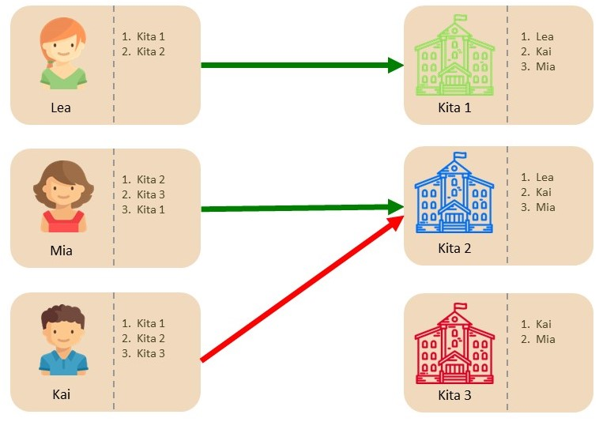

  3.  In der dritten Runde macht Kai noch der letzten Kita ein Angebot, welches direkt angenommen wird. 

Abbildung 3: 

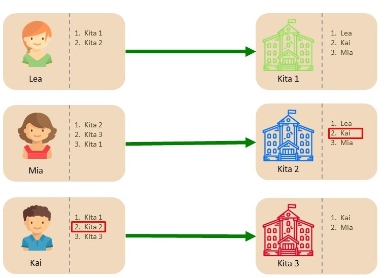

**Nicht Stabil**: Kai würde lieber einen Platz bei Kita 2 haben und hat höhere Priorität als Mia.

**Nicht Strategie-Sicher**: Anstatt zuerst bei Kita 1 ein Angebot zu machen, hätte Kai einen besseren Betreuungsplatz ergattert, hätte er sich direkt in Runde 1 bei Kita 2 beworben. 

**Unkoordiniertes Verfahren**:

Bei dem, was wir als unkoordiniertes Verfahren bezeichnen, unterbreiten die Kitas den Bewerbern Angebote, die angenommen oder abgelehnt werden müssen. Es handelt sich hierbei nicht um einen Mechanismus, da die Zuteilung von den (strategischen) Entscheidungen der Bewerber abhängt --- ob sie ein Angebot annehmen oder ablehnen. Zusätzlich hat sich in der Praxis gezeigt, dass dieses Verfahren zu langen Wartezeiten führt, da es oft im besten Interesse der Bewerber ist, abzuwarten, ob noch ein präferiertes Angebot unterbreitet wird, bevor sie eines der Angebote definitiv annehmen. Als nächstes folgen zwei Beispiele, im Ersten führt eine Annahme zum Verpassen eines besseren Angebots während im Zweiten das Ablehnen eines Angebots zum Verpassen eine Betreuungsplatzes führt:

  1.  Kitas machen Angebote ihrer Priorität folgend. Lea bekommt ein Angebot ihrer „Lieblingskita“ und nimmt deshalb direkt Kita 1 an und lehnt Kita 2 ab. Mia muss        warten da ihr kein Angebot in dieser Runde unterbreitet wird, während Kai sich entscheiden das Angebot von Kita 3 anzunehmen. 

Abbildung 4: 

  2.  Da Kita 1 und 3 jeweils ihre Plätze gefüllt haben, macht nur noch Kita 2 ein Angebot an Kai. Dieser hat aber bereits einer anderen Kita zugesagt und kann das neue, präferierte Angebot nicht annehmen. 

Abbildung 5: 

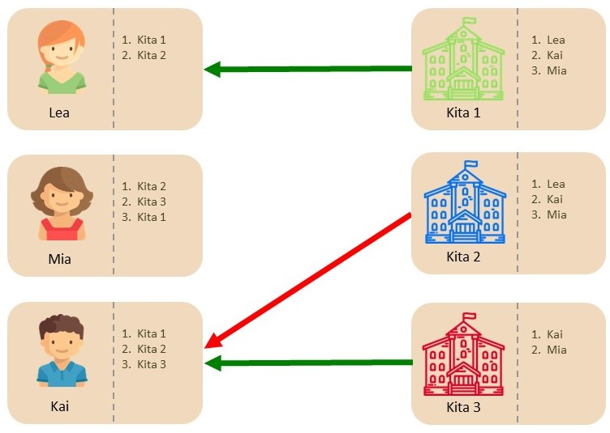

  3.  Kita 2 macht nun ein Angebot an Mia, welche dieses annimmt. 

Abbildung 6: 

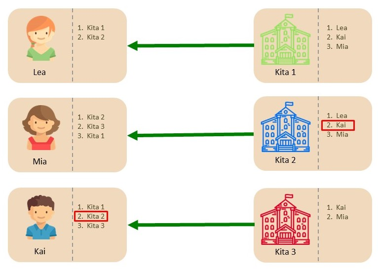

**Nicht Stabil**: Kai würde lieber einen Platz bei Kita 2 haben und hat höhere Priorität als Mia.

**Nicht Strategie-Sicher**: Statt das Angebot von Kita 3 anzunehmen, wäre es in dem Fall besser gewesen, es abzulehnen. 

**Unkoordiniertes Verfahren**:

  1.  Kitas machen Angebote ihrer Priorität folgend. Lea bekommt ein Angebot ihrer „Lieblingskita“ und nimmt deshalb direkt Kita 1 an und lehnt Kita 2 ab. Mia muss warten da ihr kein Angebot in dieser Runde unterbreitet wird, während Kai sich entscheiden das Angebot von Kita 3 abzulehnen. 

Abbildung 7: 

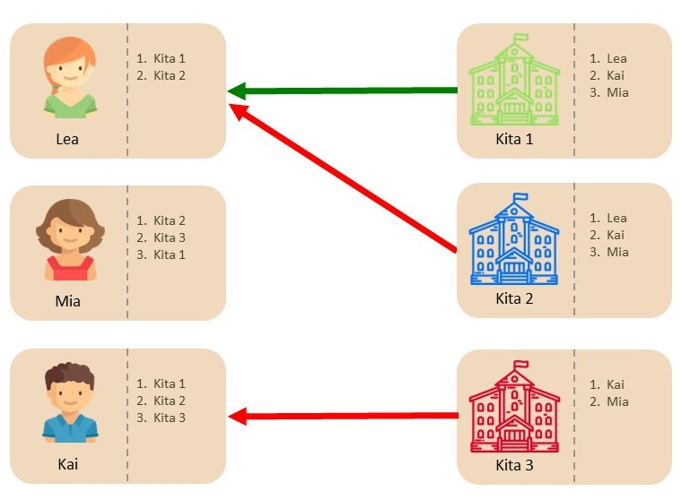

  2.  Sowohl Kita 2 als auch Kita 3 müssen neue Angebote machen. Kais Ablehnung des ersten Angebots macht sich bezahlt da er jetzt ein präferiertes Angebot von Kita 2 annehmen kann. Mia entscheidet sich ebenfalls das Angebot von Kita 3 abzulehnen da sie auf ein präferiertes Angebot wartet (beachte das Mia nicht weiß welche Kitas bereits Betreuungsplatzzusagen gemacht habe und welche ihr noch ein Angebot unterbreiten könnten).

Abbildung 8: 

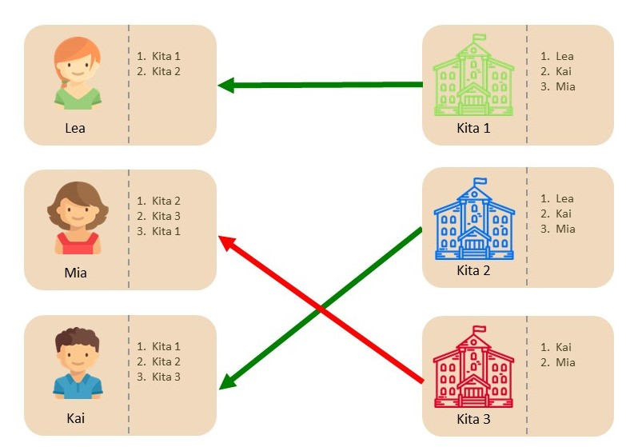

  3.  Kita 3 ist die einzig verbleibende Kita ohne Betreuungsplatzzusage. Da Kita 3 schon allen interessierten Bewerbern ein Angebot gemacht hat und die anderen Kitas ihre Betreuungsplätze gefüllt haben, bleibt Mia zumindest vorerst ohne Betreuungsplatz. 

Abbildung 9: 

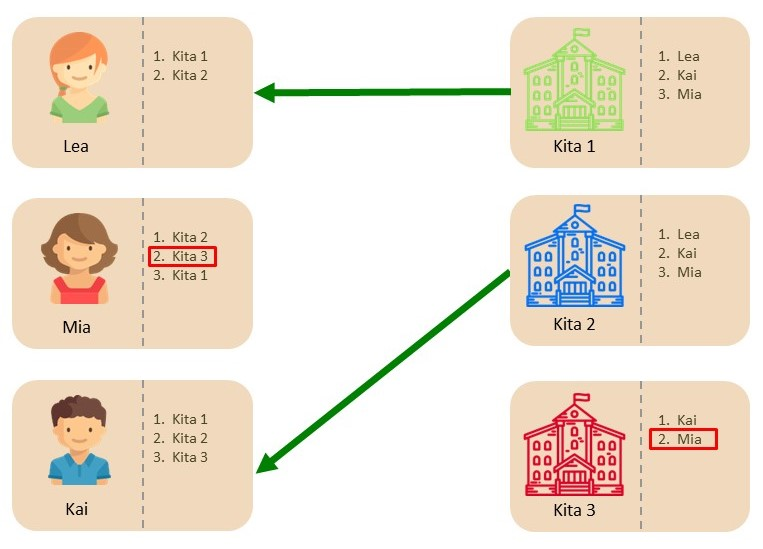

**Nicht Stabil**: Mia würde lieber einen Platz bei Kita 3 haben und Kita 3 hat einen freien Betreuungsplatz.

**Nicht Strategie-Sicher**: Statt das Angebot von Kita 3 abzulehnen, um auf ein präferiertes zu spekulieren, wäre es in dem Fall besser gewesen, es anzunehmen. 

Obwohl es bei einer unkoordinierten Vergabe nicht klar ist, welche Verteilung entstehen wird, ist dieser Vergabeprozess problematisch, da die entsprechende Verteilung stark von den strategischen Entscheidungen der Bewerber (Angebote anzunehmen oder abzulehnen) abhängt und oft zu instabilen Verteilungen führen kann. 

**Deferred Acceptance Mechanismus**:

Wie in den vorangegangenen  Beispielen illustriert wurde, hängt die Problematik von Instabilität und Strategie-Sicherheit mit der direkten Annahme zusammen. Der Deferred Acceptance Mechanismus löst das Problem, indem er es Bewerbern erlaubt, das beste Angebot zu halten; sie aber nicht dazu zwingt, ein Angebot direkt anzunehmen (Deferred Acceptance = Verzögerte Annahme): 

  1.  Kitas machen Angebote ihrer Priorität folgend. Lea bekommt ein Angebot von Kita 1 und Kita 2 und lehnt Kita 2 ab (roter Pfeil) wären sie das Angebot von Kita 1 hält (grauer Pfeil). Mia muss warten da ihr kein Angebot in dieser Runde unterbreitet wird, während Kai das Angebot von Kita 3 hält (grauer Pfeil) --- im Gegenteil zum „Unkoordinierten Verfahren“ muss sich Kai nicht entscheiden ob er das Angebot annimmt oder Ablehnt und kann keinen „strategischen Fehler“ machen.

Abbildung 10: 

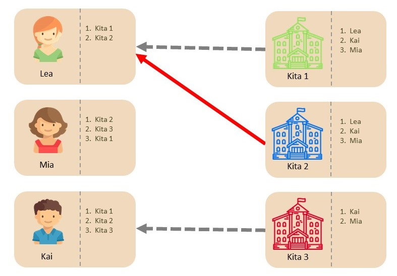

  2.  Kitas deren Angebote gehalten werden, machen in dieser Runde jeweils keine neuen Angebote. Deshalb macht nur Kita 2 ein neues Angebot an Kai, welcher dieses hält und Kita 3 eine Absage erteilt. 

Abbildung 11: 

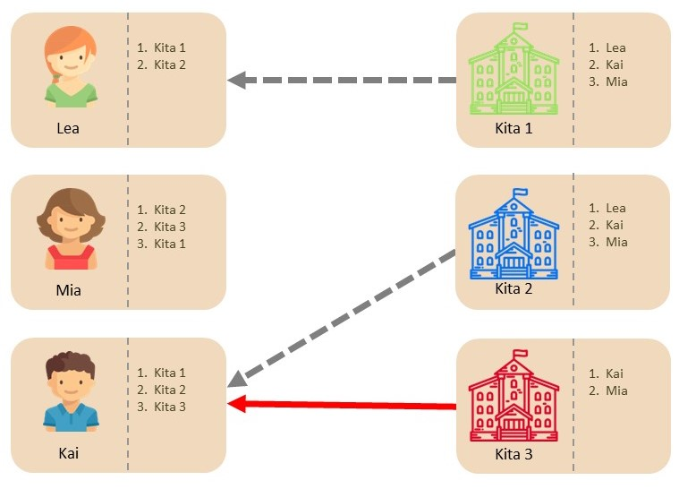

  3.  Kitas deren Angebote gehalten werden, machen in dieser Runde jeweils keine neuen Angebote. Deshalb macht nur Kita 3 ein neues Angebot an Mia welche dies hält.

Abbildung 12: 

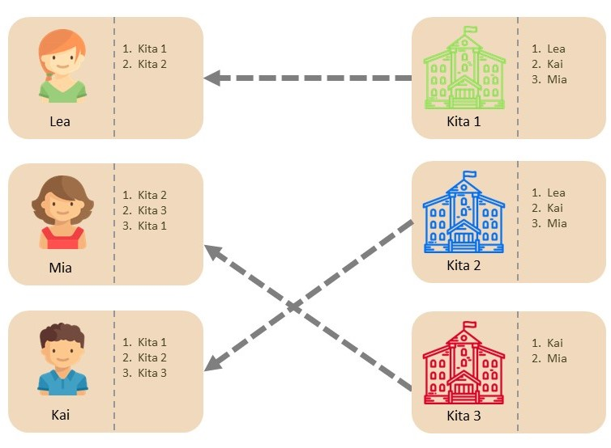

  4.  Wenn keine Kita mehr ein neues Angebot machen kann, werden die gehaltenen Angebote angenommen und eine finale Zuteilung ist erreicht (grüne Pfeile). 

Abbildung 13: 

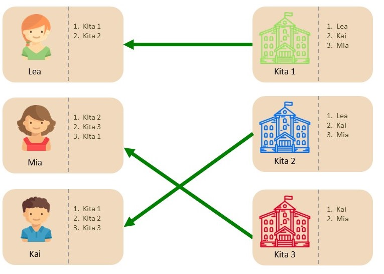

**Stabil**: Wie auch im Beispiel ergibt der Deferred Acceptance Mechanismus immer eine stabile Zuteilung. 

**Strategie-Sicher**: Keiner der Bewerber kann jeweils einen präferierten Betreuungsplatz erhalten, wenn er eine oder mehrere Kitas in seiner Rangliste nach oben oder unten verschiebt. 

---

## Wo sind die Grenzen des Algorithmus/Systems

**Stabilität ist nur so gut wie der Kriterienkatalog**

Vor einer Kita-Vergabe einigen sich Kitas auf einen oder mehrere Kriterienkataloge: Aus dem Kriterienkatalog ergibt sich die Priorität eines jeden Bewerbers — vgl. Fallbeispiel Landkreis Steinfurt. 

Die Akzeptanz einer stabilen Zuteilung hängt direkt von der Akzeptanz der Kriterienkataloge ab — Stabilität ist nur so gut wie der Kriterienkatalog. Wenn Bewerber die Kriterien als unfair empfinden, werden die Bewerber die daraus resultierende stabile Zuteilung auch für unfair halten.

Für eine gerechte und akzeptable Kitavergabe ist deshalb ein gut designter Kriterienkatalog unabdingbar. In diesem Zusammenhang sei erwähnt, dass dies einhergeht mit einer klaren und transparente Kommunikation der angewendeten Kriterien gegenüber den Bewerbern. Dies ermöglicht eine nachvollziehbare Begründung für die Ablehnung eines Bewerbers.

**Anzahl Plätze**

Der Vollständigkeit halber sei hier erwähnt, dass — natürlich — kein Zuteilungsverfahren mehr Plätze vergeben kann, als Plätze vorhanden sind. Die Adaption des Deferred Acceptance Mechanismus hilft dabei, die vorhandenen Plätze möglichst fair zu verteilen — gegeben, dass der Kriterienkatalog fair gestaltet ist. Langfristig kann die Kitavergabe vor allem durch einen Ausbau von Plätzen verbessert werden.

**Geschwisterkinder**

Geschwisterkinder verursachen Wechselwirkungen, die dazu führen, dass der Deferred Acceptance Mechanismus nicht mehr eine stabile Zuteilung garantiert. Die Wechselwirkungen von Geschwisterkindern und allfällige Lösungsansätze werden im Folgenden diskutiert. 

**Geschwisterkinder: Gleichzeitige Bewerbung**

Gerade Bewerber, die mehrere Kinder gleichzeitig zuteilen möchten — z.B. Zwillinge, oder Neuzuzüge — sind problematisch für eine stabile Zuteilung. Das Problem ergibt sich, da die Präferenzen bei einer Bewerbung nicht mehr unabhängig sind, sondern z.B. häufig der Wunsch besteht, dass verschiedene Kinder desselben Bewerbers der gleichen Kita zugeteilt werden.

Auch wenn die Kinder desselben Bewerbers gebündelt werden und nur zusammen angenommen werden können, ergeben sich Probleme für andere Bewerber. Generell wurde gezeigt, dass es bei solchen Wechselwirkungen kein Zuteilungsverfahren gibt, welches immer eine stabile Zuteilung findet.

Hier hat sich die semi-zentrale Zuteilung bewährt. Da im System gekennzeichnet wird, welche Kinder Geschwister sind, können die Kitas koordinieren und so Geschwisterkindern jeweils ein Angebot derselben Kita unterbreiten, welche genügend Kapazität für beide hat. Dadurch können die oben erwähnten Probleme weitestgehend vermieden werden.

**Geschwisterkinder: Bereits in Betreuung**

Das Problem bei Geschwisterkindern, bei denen sich ein Teil bereits in Betreuung bei einer Kita befindet, ist einfacher zu lösen. Grundsätzlich tritt hier kein Problem auf, wenn das unzugeteilte Geschwisterkind (die unzugeteilten Geschwisterkinder) eine so hohe Priorität hat, dass es sicher einen Platz in der Kita findet, in welcher sich seine Geschwister bereits zugeordnet sind.

Dafür kann beispielsweise der Punkt ”Geschwisterkinder bei der Kita” in den Kriterienkatalog aufgenommen und genügend gewichtet werden. Auch hier hat sich die semi-zentrale Zuteilung bewährt. Falls dies nicht schon so im relevanten Kriterienkatalog vermerkt ist, können hier Kitas einem Kind, bei dem sie ein Geschwister betreuen, ein Angebot unterbreiten und gegebenenfalls von der Anfangs bestimmten Priorität abweichen.

**Verständnis**

Bei der zentralen Durchführung des Deferred Acceptance Mechanismus werden Prioritäten der Kitas und Präferenzen/Rankings der Bewerber zentral gesammelt, und anschließend wird eine Zuteilung direkt ermittelt. In diesem Fall ist es für Beteiligte oft schwer nachzuvollziehen, wie die Verteilung zustande gekommen ist.

Auch hier hat es sich bewährt, die Verteilung, mindestens bei der Einführung des Deferred Acceptance Mechanismus, semi-zentral durchzuführen, damit die Kitas den Mechanismus  direkt ,,miterleben” können. Gerade bei Kommunen, die das Verfahren  über mehrere Jahre adaptiert haben, hat sich dadurch ein Vertrauen und intuitives Verständnis gegenüber dem Deferred Acceptence Mechanismus gebildet.

---

[^2]: Tatsächlich gibt es zwei Hauptvarianten des Deferred Acceptance Mechanismus welche davon abhängen, welche Seite Angebote unterbreitet respektive Angebote vorläufig annimmt. Diese weisen auch theoretische Unterschiede auf. Wir beschränken uns auf die Variante, bei der die Kitas Angebote unterbreiten — da sich diese in der Praxis durchgesetzt hat.

