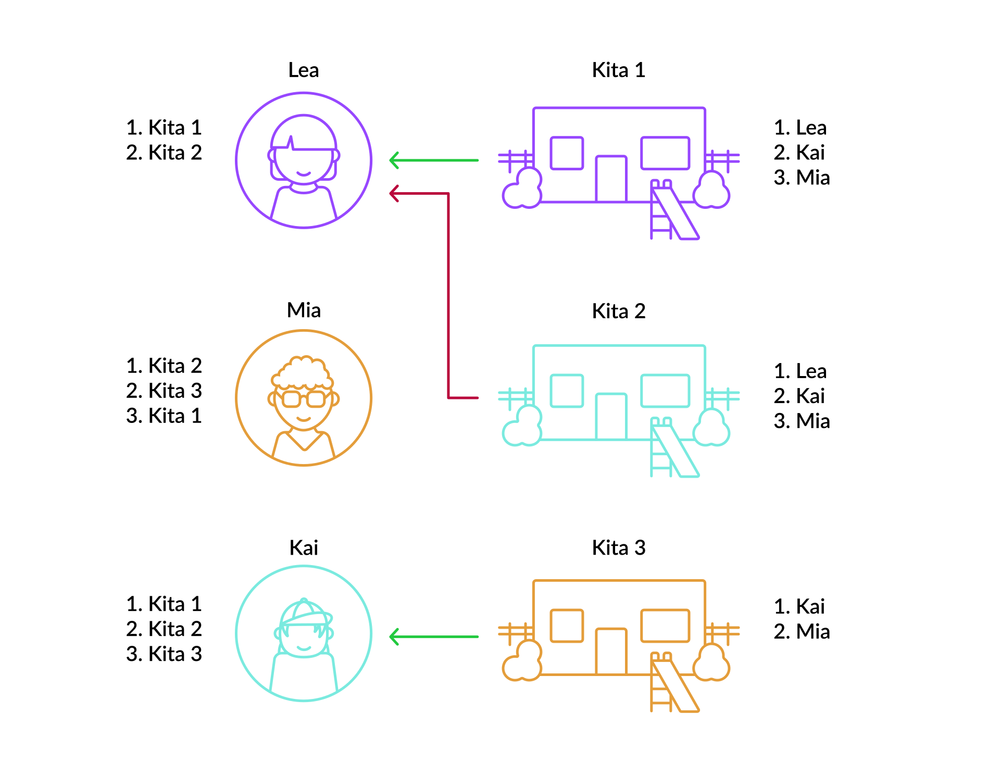
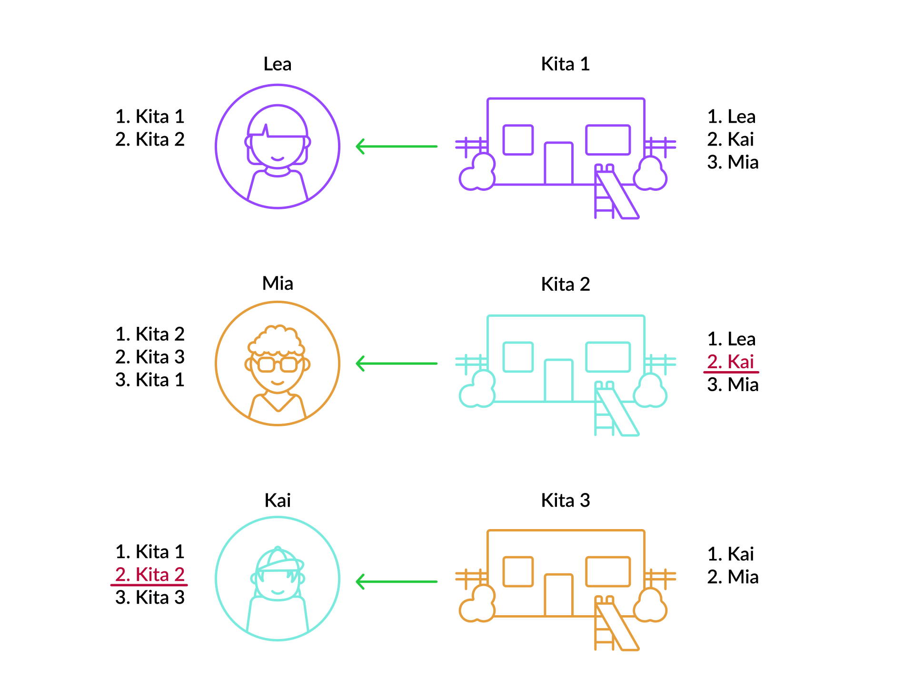

# Beispiel: Unkoordiniertes Verfahren

Im Folgenden wird das exakt selbe Beispiel benutzt, um die Funktionsweise drei verschiedener Zuteilungsmethoden([First-Preference-First-Mechanismus](/docs/Gale-Shapley-Verfahren/First-Preference-First-Mechanismus), [unkoordiniertes Verfahren]() und [Gale-Shapley-Verfahren](/docs/Gale-Shapley-Verfahren/Gale-Shapley-Beispiel)) zu illustrieren und intuitiv aufzuzeigen, weshalb das Gale-Shapley Verfahren als einziges Zuteilungsverfahren sowohl stabil als auch strategiesicher ist.

---

Bei dem, was wir als unkoordiniertes Verfahren bezeichnen, unterbreiten die Kitas den Bewerbern Angebote, die angenommen oder abgelehnt werden müssen. Es handelt sich hierbei nicht um einklar definiertes Verfahren - das heißt selbst unter identischen Prioritäten und Präferenzen können sich verschiedene Zuteilungen ergeben, da die Zuteilung von den (strategischen) Entscheidungen der Bewerber abhängt.

Es hat sich in der Praxis gezeigt, dass dieses Verfahren zu langen Wartezeiten führt, da es oft im besten Interesse der Bewerber ist, abzuwarten, ob noch ein präferiertes Angebot unterbreitet wird, bevor sie eines der Angebote definitiv annehmen. Als Nächstes folgen zwei Beispiele, im ersten führt eine Annahme zum Verpassen eines besseren Angebots während im zweiten das Ablehnen eines Angebots zum Verpassen eine Betreuungsplatzes führt:

**1.** Kitas machen Angebote ihrer Priorität folgend. Lea bekommt ein Angebot ihrer „Lieblingskita“ und nimmt deshalb direkt Kita 1 an und lehnt Kita 2 ab. Mia muss warten, da ihr kein Angebot in dieser Runde unterbreitet wird, während Kai sich entschieden hat, das Angebot von Kita 3 anzunehmen. 

<small>Abbildung: Unkoordiniertes Verfahren I - Schritt 1<small>
  
{:height="500px" width="700px"}

**2.** Da Kita 1 und 3 jeweils ihre Plätze gefüllt haben, macht nur noch Kita 2 ein Angebot an Kai. Dieser hat aber bereits einer anderen Kita zugesagt und kann das neue, präferierte Angebot nicht annehmen. 

<small>Abbildung: Unkoordiniertes Verfahren I - Schritt 2<small>
  
{:height="500px" width="700px"}

**3.** Kita 2 macht nun ein Angebot an Mia, welche dieses annimmt. 

<small>Abbildung: Unkoordiniertes Verfahren I - Schritt 3<small>
  
{:height="500px" width="700px"}

{: .highlight}
> **Nicht stabil**: Kai würde lieber einen Platz bei Kita 2 haben und hat höhere Priorität als Mia.
>
> **Nicht strategiesicher**: Statt das Angebot von Kita 3 anzunehmen, wäre es für Kai in dem Fall besser gewesen, es abzulehnen.

---

Nachdem wir nun ein Beispiel besprochen haben, bei dem die verfrühte Annahme eines Angebots zum Verpassen eines besseren Angebots führt, besprechen wir nun ein zweites Beispiel, bei dem  das Ablehnen eines Angebots zum Verpassen eine Betreuungsplatzes führt. 
  
**1.** Kitas machen Angebote ihrer Priorität folgend. Lea bekommt ein Angebot ihrer „Lieblingskita“ und nimmt deshalb direkt Kita 1 an und lehnt Kita 2 ab. Mia muss warten, da ihr kein Angebot in dieser Runde unterbreitet wird, während Kai sich entschieden hat, das Angebot von Kita 3 abzulehnen. 

<small>Abbildung: Unkoordiniertes Verfahren II - Schritt 1<small>
  
{:height="500px" width="700px"}

**2.** Sowohl Kita 2 als auch Kita 3 müssen neue Angebote machen. Kais Ablehnung des ersten Angebots macht sich bezahlt, da er jetzt ein präferiertes Angebot von Kita 2 annehmen kann. Mia entscheidet sich ebenfalls, das Angebot von Kita 3 abzulehnen, da sie auf ein präferiertes Angebot wartet (beachte, dass Mia nicht weiß, welche Kitas bereits Betreuungsplatzzusagen gemacht haben und welche ihr noch ein Angebot unterbreiten könnten).

<small>Abbildung: Unkoordiniertes Verfahren II - Schritt 2<small>

{:height="500px" width="700px"}

**3.** Kita 3 ist die einzig verbleibende Kita ohne Betreuungsplatzzusage. Da Kita 3 schon allen interessierten Bewerbern ein Angebot gemacht hat und die anderen Kitas ihre Betreuungsplätze gefüllt haben, bleibt Mia zumindest vorerst ohne Betreuungsplatz. 

<small>Abbildung: Unkoordiniertes Verfahren II - Schritt 3<small>

{:height="500px" width="700px"}

    
{: .highlight}
> **Nicht stabil**: Mia würde lieber einen Platz bei Kita 3 haben und Kita 3 hat einen freien Betreuungsplatz.
>
> **Nicht strategiesicher**: Statt das Angebot von Kita 3 abzulehnen, um auf ein präferiertes zu spekulieren, wäre es für Mia in dem Fall besser gewesen, es anzunehmen.
 

Obwohl es bei einer unkoordinierten Vergabe nicht klar ist, welche Verteilung entstehen wird, ist dieser Vergabeprozess u.a. problematisch, da die entsprechende Zuteilung stark von den strategischen Entscheidungen der Bewerber (Angebote  zu einem bestimmten Zeitpunkt anzunehmen oder abzulehnen) abhängt und oft zu instabilen Verteilungen führen kann. 

  

