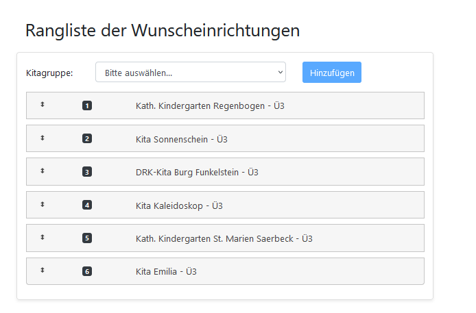
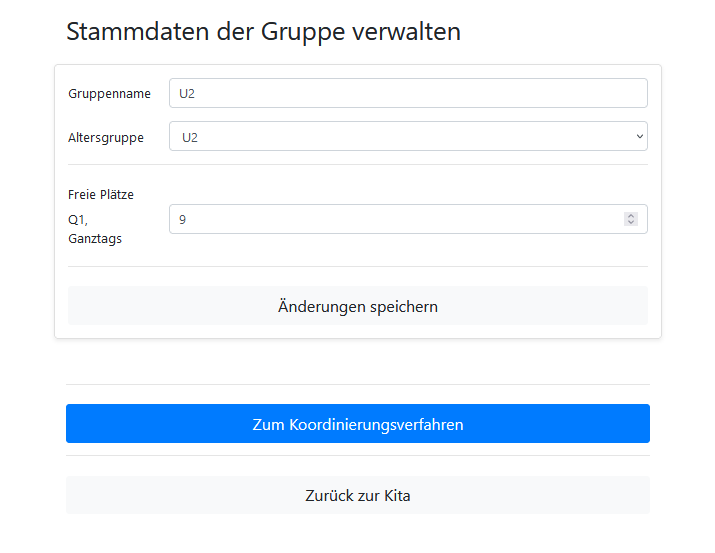
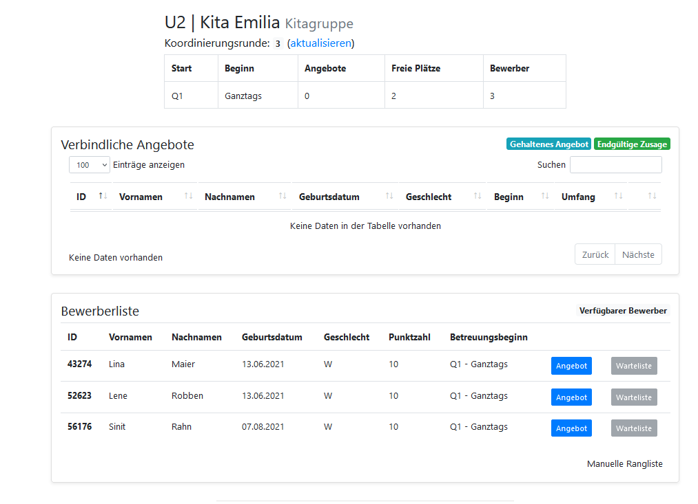
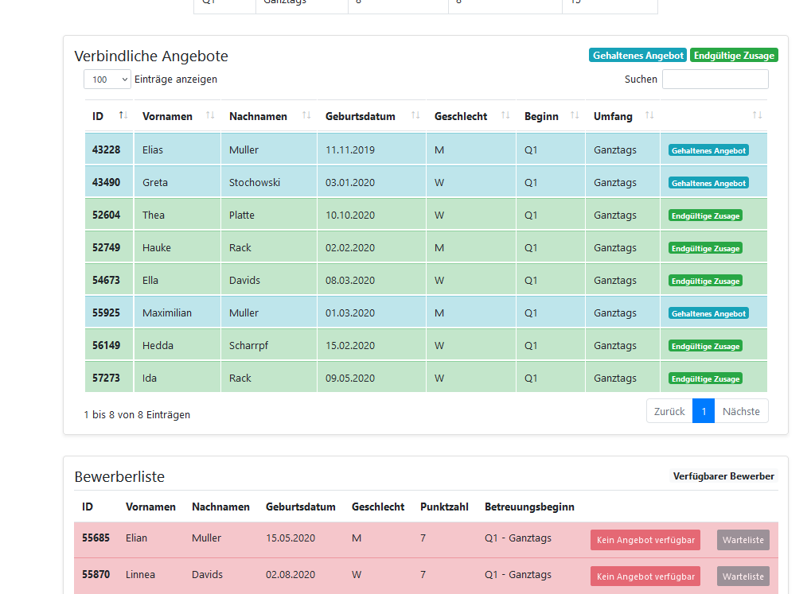

# Der Standardfall
{: .no_toc }

## Inhalt
{: .no_toc .text-delta }

1. TOC
{:toc}

---

## Welche Daten benötigt KitaMatch?

Um das oben beschriebene Verfahren umsetzen zu können, benötigt die Software die entsprechenden Daten der Kinder. Diese Daten müssen in einem bestimmten Format in Excel aufbereitet werden.

<small>Abbildung: Beispiel eines vollständigen Datensatzes</small>

Obligatorische Angaben sind Name, Geburtsdatum, Alterskohorte und die von den Eltern geäußerten Wunscheinrichtungen (erste bis maximal zwölfte Wunscheinrichtung). Wichtig hierbei ist, dass ein Dropdown-Menü für die Namen der Einrichtungen verwendet wird. Optional können zudem noch eine Identifikation (ID) und das Geschlecht in KitaMatch angezeigt werden. In der Spalte „Rangordnungspunkte“ werden, basierend auf dem gewählten Kriterienkatalog, die resultierenden Punktewerte pro Kind angegeben. Zusätzlich gibt es noch die Möglichkeit, bis zu sechs Zusatzkriterien zu definieren, für die Kinder nur in bestimmten Kitas Zusatzpunkte erhalten. Hierfür werden in der jeweilige Zelle einfach der Namen der Kita, in der das Kind jeweils Zusatzpunkte bekommen soll, erfasst. Zusätzlich muss jeweils definiert werden, wie viele Zusatzpunkte das jeweilige Zusatzkriterium wert ist. 

Nachdem diese Daten zur Verfügung gestellt sind, müssen diese von der Systemadministration in die KitaMatch Software eingepflegt werden (<mark>Kapitel 3.4</mark>). Wir empfehlen die Bewerberlisten zunächst auf Vollständigkeit und Plausibilität zu prüfen, bevor diese den Kitaleitungen bereitgestellt werden. Diese Bewerberlisten beruhen auf dem zugrunde gelegten Kriterienkatalog und den entsprechend ermittelten Punktwerten pro Kind. Bei Punktgleichheit sortiert das Programm automatisch das ältere Kind einen Platz vor dem anderen (jüngeren) Kind. 

---

## Systemanforderungen

Um das System zuverlässig nutzen zu können, empfehlen wir die neueste Version von Google Chrome, Firefox oder Microsoft Edge zu verwenden. Um sich im System einzuloggen, benötigt man folgende Informationen:

  1. Einen Link zur Website
  2. Die Login-Informationen (E-Mail-Adresse und Passwort)

Diese Daten werden von der Systemadministration bereitgestellt (<mark>Kapitel 3.4</mark>).

---

## Systemzugang

Mit den von der Systemadministration zur Verfügung gestellten Login-Daten, kann man sich auf der Webseite einloggen. Zum Login kommt man über den zur Verfügung gestellten Link zur Website.

<small>Abbildung: Login-Menü</small>
  

- Vergessenes Passwort zurücksetzen:
  Falls das Passwort oder die E-Mail-Adresse verloren oder vergessen gehen, können diese von der Systemadministration wieder hergestellt werden.

--- 

## Navigation

KitaMatch kann über die permanente Navigationsleiste oben auf der Benutzeroberfläche und über die Knöpfe auf der Übersichtsseite navigiert werden.

-	Auf der Übersichtsseite hat man direkten Zugang zum Zuteilungsverfahren („Zuteilung“), zur Bewerberliste („Bewerber“) und zur Liste aller Kitagruppen („Kitagruppen“).
-	Die letzteren zwei Seiten („Kitagruppen“, „Bewerber“) können auch direkt  über die Navigationsleiste erreicht werden.
-	Im Dropdown-Menü „Benutzer“, ist es möglich sich abzumelden und das Passwort zu ändern.

<small>Abbildung: Übersichtsseite</small>
  

### Zuteilung

Die Startseite gibt eine Übersicht der aktuellen Zuordnungen im Verfahren. Bevor das Verfahren startet, sind, wie in Abbildung 16, noch „0 Zuordnungen“ vermerkt. 

Während des Verfahrens kann eine Liste mit den aktuellen Zuordnungen (Abbildung 17) sowie (weiter unten) eine Liste aller Kinder, die aktuell noch nicht zugeordnet sind (Abbildung 18) eingesehen werden. 

Bei den Zuordnungen gibt es zwei Möglichkeiten: „Finale Zuordnung“ bedeutet, dass das jeweilige Kind seiner Erstwunschkita zugeordnet wurde und entsprechend keine Möglichkeit besteht, dass es im Laufe des Verfahrens noch ein besseres Angebot bekommt. Im Gegensatz dazu bedeutet „Gehaltenes Angebot“, dass das Kind aktuell der jeweiligen Kita vorläufig zugesagt hat, es aber prinzipiell im Laufe des Verfahrens noch ein „besseres“ Angebot bekommen kann und deshalb das aktuell gehaltene Angebot noch ablehnen könnte. Diese beiden Listen von versorgten und bisher unversorgten Kindern können jeweils über den „Export“-Button in ein Excel-Dokument überführt werden. 
 

**Liste der gematchten Kinder**:
Am Ende der Vergabe kann eine Excel-Liste generiert werden, welche die finale Zuordnung des Verfahrens aufzeigt. Auf dieser Basis können die Verantwortlichen nun die „tatsächlichen“ Zu- und Absagen in der Praxis (z. B. über ein Anmeldeportal) erteilen. 

**Liste der unversorgten Kinder**: 

Eine weitere hilfreiche, zu generierende Liste ist die mit den Kindern, die noch einen Platz benötigen und bisher unversorgt sind. Dies kann daran liegen, dass die Eltern beispielsweise zu wenig Alternativen ausgewählt haben.

**Übersicht der Kitas mit freien Plätzen**:

Es kann auch sein, dass Kitas am Ende des Matchings noch freie Plätze haben. In diesem Fall hatten sie von Anfang zu wenig Bewerber:innen. Diese freien Plätze würden dann in der Praxis mit den Kindern belegt werden können, die im Matching keinen Platz erhalten und sich dann für diese Einrichtungen vormerken lassen haben. 
 
<small>Abbildung: Aktuelle Zuordnungen</small>

<small>Abbildung: Nicht zugeordnete Bewerber</small>

### Bewerber/Kinder

Unter „Bewerber“ landet man auf der Übersicht über alle an dem Verfahren teilnehmenden Bewerber/Kinder. 

Der „Status“ ist bei allen final zugeordneten Kindern „26“ und bei allen anderen „22“. Unter „Einsehen“ erhält man weitere Information über das jeweilige Kind. 

Unter „Rangliste der Wunscheinrichtungen“ kann man insbesondere die Präferenzen der Eltern einsehen. 

 
<small>Abbildung: Übersicht aller Bewerber/Kinder, die am Verfahren teilnehmen</small>

{:height="500px" width="500px"}

<small>Abbildung: Rangliste der Wunscheinrichtungen</small>

### Kitagruppen

Unter „Kitagruppen“ findet  man die Übersicht über alle Kitagruppen. Unter der jeweilige Kita (bzw. der einzelnen Alterskohorte einer Kita) kommt man zu der Ansicht, die die jeweilige Kitaleitung während des Verfahrens hat. Dieser Teil der Software, der sowohl den/die Projektmanager:in als auch die Kitaleitungen adressiert, die an dem Verfahren teilnehmen, wird im nächsten <mark>Kapitel 3.1.5</mark> erklärt.

<small>Abbildung: Liste aller Kitagruppen</small>

---

## KitaMatch aus Sicht der Kitaleitungen 

Dieses Kapitel richtet sich an die an dem Verfahren teilnehmenden Leitungen von Kitas oder Trägern und den/die Projektmanager:in.

### Systemanforderungen

Um das System zuverlässig nutzen zu können, wird empfohlen, die neueste Version von Google Chrome, Firefox oder Microsoft Edge zu verwenden. Um sich im System einzuloggen, werden folgende Informationen benötigt:

  1. Einen Link zur Website
  2. Die Login-Informationen (E-Mail-Adresse und Passwort)

Diese erhalten die Kitaleitungen von der/dem verantwortlichen Projektmanager:in (<mark>Kapitel 5</mark>). 

### Systemzugang

- Login-Menü:
  Mit den von der Systemadministration zur Verfügung gestellten Login-Daten, kann man sich auf der Webseite einloggen. Zum Login kommt man über den zur Verfügung gestellten Link zur Website.

<small>Abbildung: Login-Menü aus Sicht der Kitaleitungen</small>

- Vergessenes Passwort zurücksetzen:
  Falls das Passwort oder die E-Mail-Adresse verloren oder vergessen gehen, können diese von der Systemadministration wieder hergestellt werden.

### Navigation

Nach dem Login erscheint eine erste Übersichtsseite. Unten findet man drei blaue Felder zur Navigation der drei Altersgruppen.

{: .note-title}
> Tipp
>
> Falls man zu irgendeinem Zeitpunkt nicht mehr weiß, wo man sich gerade befindet, gelangt man per Mausklick auf „KitaMatch“ zurück auf die Übersichtsseite.

<small>Abbildung: Übersichtsseite aus Sicht der Kitaleitungen</small>

**Freie Plätze einpflegen**

Unter jeder der Altersgruppen erscheint eine Übersicht über die jeweilige Gruppe. Hier können die freien Plätze der jeweiligen Kita einpflegt werden, welche in der jeweiligen Altersklasse zur Verfügung stehen. Danach muss die Änderung via „Änderungen speichern“ übernommen werden. Die entsprechenden verfügbaren Betreuungsplätze müssen jeweils in jeder Altersgruppe einmal eingetragen und abgespeichert werden. Wichtig zu beachten ist, dass einmal eingepflegte Zahlen nicht mehr reduziert, sondern nur noch erhöht werden können.[^2]

<small>Abbildung: Freie Plätze einpflegen</small>

{:height="500px" width="500px"}

### Bewerberliste und Koordinierungsverfahren

Das Zuteilungsverfahren besteht aus mehreren Runden, in denen Kitas/Kindertagesstätten Kindern Angebote machen. Nach jeder Runde erhalten die Kitas dann Feedback darüber, welche Kinder Ihnen zugeteilt wurden. Unter „Zum Koordinierungsverfahren“ können Kitas jeweils eine Übersicht über die Kinder bekommen, die sich bei Ihr beworben haben. Außerdem können Kitas auf dieser Seite den Kindern Angebote machen, und einsehen, ob ihre Angebote (vorläufig) angenommen oder ablehnt werden.

Die folgenden vier Unterkapitel beschreiben KitaMatch vor dem Matching-Day, während einer Runde und nach einer Runde.

**Vor dem Matching-Day**

Die Seite ist prinzipiell so aufgebaut, dass oben die wichtigsten Informationen zusammengefasst werden und unten zwei Tabellen aufbereitet sind. In der ersten Tabelle findet man eine Übersicht aller Kinder, denen ein verbindliches Angebot gemacht wurde. Sie ist vor der ersten Runde natürlich noch leer. Darunter findet man unten eine Tabelle mit allen Kindern, die sich in der Kita in der jeweiligen Altersgruppe beworben haben. Die Kinder sind bereits nach dem jeweiligen Kriterienkatalog vorsortiert. Bei Punktegleichstand zwischen zwei oder mehreren Kindern, erfolgt die Vorsortierung nach Alter, wobei die ältesten Kinder weiter oben stehen. Mittels „Manuelle Rangliste“, kann die Vorsortierung der Kinder manuell angepasst werden. 

Eine Anpassung der Reihenfolge der Kinder auf der Liste bedeutet jedoch eine Abweichung vom Kriterienkatalog. Deshalb sollte ein solcher  Schritt transparent und nachvollziehbar in Absprache mit dem Jugendamt erfolgen. 

<small>Abbildung: Vor dem Matching-Day</small>

**Während einer Vergaberunde**

Hat der/die Projektmanager:in den Matching-Day eingeläutet, können Kitas, den Kindern Angebote unterbreiten. Hierfür klickt man auf das blau hinterlegte „Angebot“-Feld in der Tabelle „Bewerberliste“ und bestätigen das jeweilige Angebot, indem man auf das im Dialogfenster ebenfalls blau hinterlegte „Q1, Ganztags“-Feld klickt. 

<small>Abbildung: Angebote unterbreiten</small>

Diesen Schritt kann jede Kita beliebig oft wiederholen, bis die Anzahl der eingepflegten Betreuungsplätze erreicht wird. 

Dadurch rücken die Kinder, denen ein Angebot gemacht wurde, in die obere Tabelle und sind vorerst blau hinterlegt. Diese Angebote lassen sich so lange zurücknehmen, bis der/die Projektmanager:in den zentralen „Vergabe starten“-Button betätigt hat <mark>(siehe Abbildung 16)</mark>. 

Alle Kinder, denen eine Kita zu einem gewissen Zeitpunkt gerade kein Angebot machen kann – zum Beispiel weil zu diesem Zeitpunkt keine weiteren freien Plätze mehr vorhanden sind –, erscheinen rot. 

Sofern die Einrichtung keine freien, zu belegenden Plätze hat, setzen Sie das Matching für diese Altersgruppe aus. 

<small>Abbildung: Während des Matching-Days</small>

Wenn alle Kitaleitungen mit einer Runde fertig sind, klickt die Projektleitung auf den zentralen, blau hinterlegten "Vergabe starten"-Button auf der Hauptseite. 

**Nach einer Vergaberunde**

Nachdem die Projektleitung den „Vergabe starten“-Button geklickt hat, muss jede Kita durch „aktualisieren“ oben auf der Seite zunächst die Seite aktualisieren. 

Jetzt wird angezeigt, wie sich die Kinder, denen eine Kita in der vorigen Runde ein Angebot gemacht wurde, sich (über die hinterlegten Präferenzen) entschieden haben. Prinzipiell gibt es drei Möglichkeiten:

1.	Beim Kind erscheint in der oberen Tabelle rechts in Grün „Endgültige Zusage“. Dies bedeutet, dass das Angebot der Kita angenommen wurde, und sich auch im weiteren Verlauf des Verfahrens nichts mehr daran ändern kann. 
2.	Beim Kind erscheint in der oberen Tabelle rechts in Blau „Gehaltenes Angebot“. Dies bedeutet, dass ein Angebot vorläufig, aber noch nicht endgültig angenommen wurde. Dies liegt daran, dass diese Kind potenziell noch ein besseres Angebot in einer zukünftigen Runde erhalten könnte. 

Das Kind erscheint rot in der unteren Tabelle („Kein Angebot verfügbar“). Dies bedeutet, dass dem Kind aktuell kein Angebot gemacht werden kann. Dies kann zwei Gründe haben: Entweder hat die Kita keine Kapazität (mehr), um dem Kind ein Angebot zu machen, oder das Kind hat ein Angebot einer präferierten Kita erhalten. 

<small>Abbildung: Verbindliche Angebote</small>

Dieser Vergabeschritt wird so lange wiederholt, bis alle Kitas entweder keine freien Plätze oder keine Kinder mehr in ihrer Liste haben, denen sie noch Angebote unterbreiten können (<mark>Siehe Kapitel 2</mark> für eine Erklärung des Vergabeverfahrens).

**Ende des Verfahrens**

Nachdem die Projektleitung auf den “Vergabe starten"-Button geklickt hat, teilt sie den Kitaleitungen jeweils mit, dass diese ihre Seite aktualisieren sollen. Ab der vierten Runde sollte die Projektleitung dann zudem die Kitaleitungen fragen, ob diese noch weitere Angebote machen können. Das Verfahren endet genau dann, wenn in einer bestimmten Runde alle Kitaleitungen diese Frage mit “Nein“ beantworten. 

---

[^2]: Falls eine Reduzierung doch einmal nachträgliche Änderung notwendig sein sollte, kann diese von der Systemadministration angepasst werden.

[^3]: Wenn man in einer bestimmten Runde nicht für jeden freien Platz ein Angebot macht, hat man in unserem Verfahren keinen Nachteil.
