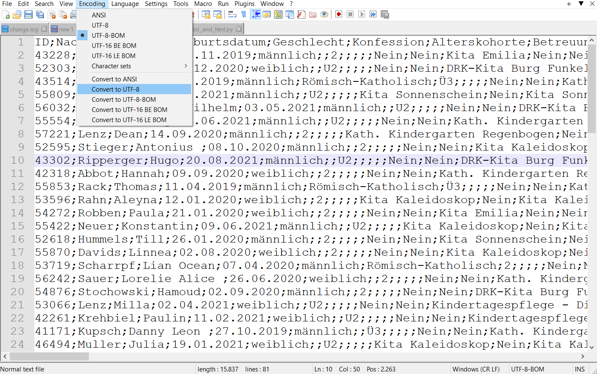
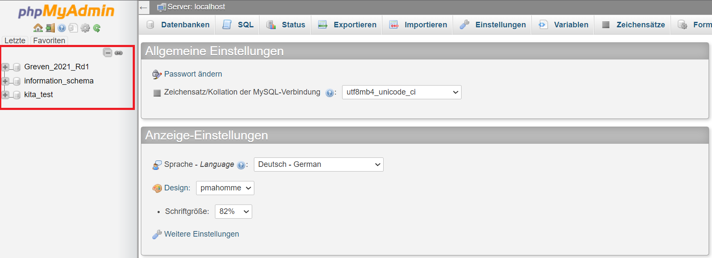
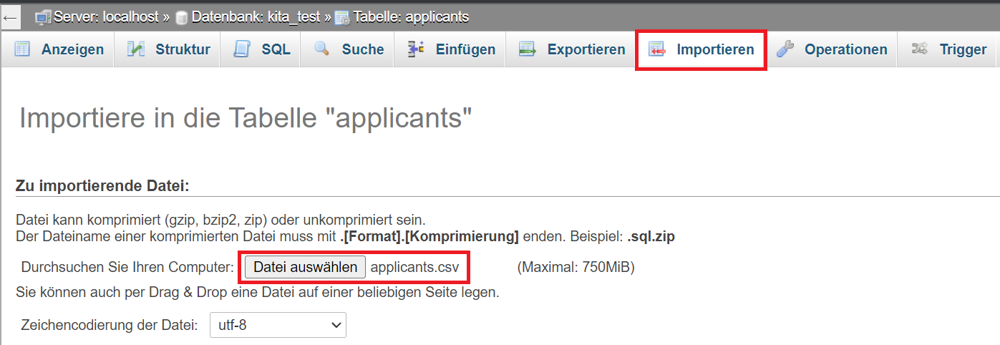

# IT Guide
{: .no_toc }

Das folgende Kapitel wendet sich an den Systemadministrator einer Kommune. Die Beschreibungen unten befähigen diese Person mit starkem IT Background dazu, KitaMatch in einer bestimmten Kommune eigenständig umzusetzen.

## Inhalt
{: .no_toc .text-delta }

1. TOC
{:toc}

---

## Zusammenfassung der benötigten Installationen

- RStudio (R-Version 4.0.3 64-bit)
- Notepad++
- PHP
- git
- MySQL

## Zusammenfassung der benötigten Dateien:

- <tt>Vorlage_Kitamatch_Stadt.xlsx</tt>
- <tt>Create_initial_tables.R</tt> → Erzeugt <tt>CSV-Dateien</tt> für phpMyAdmin
  - Benötigte Pakete/Installationen:
    - <tt>stringr</tt>
    - <tt>dplyr</tt>
    - <tt>bcrypt</tt>
    - <tt>devtools</tt>
    - <tt>PasswordGen</tt>
    - <tt>xlsx</tt> oder <tt>openxlsx</tt>
    - <tt>Rtools</tt>

---

## Erstellen einer neuen Umgebung für die Kommune

Im Folgenden wird dargestellt, wie die Kitamatch-Umgebung mithilfe PHP konfiguriert wird. Bei abweichender Serversoftware gehen Sie analog vor.

**1.** Erstellen Sie einen neuen mit Ordner mit dem Stadtnamen unter (<tt>/var/www/html</tt>):
       
       $ mkdir {Stadtname}

**2.** Navigieren Sie zu diesem Ordner und klonen Sie das folgende git Repository:
       
       $ git clone https://github.com/svengiegerich/kitamatch.git

**3.** Wechseln Sie zum git Branch <tt>uiFix</tt>:
       
       $ git checkout uiFix

**4.** Richten Sie die Umgebungsvariablen in der <tt>.env</tt> Datei ein:
       
       $ Is -a        // Um versteckte Ordner zu sehen       
       $ sudo nano .env
       
  Aktualisieren Sie <tt>APP_NAME</tt>, <tt>APP_URL</tt> & <tt>DB_DATABASE</tt>

**5.** Nehmen Sie die Kita-spezifischen Konfigurationen unter <tt>config/kitamatch_config.php</tt> vor:
       
       $ cd config/       
       $ sudo nano kitamatch_config.php

  In dieser Datei finden Sie Konfigurationen bezüglich des Matching-Prozesses. Achten Sie hierbei insbesondere auf die Einstellungen des Betreuungsumfangs, des Betreuungsbeginns und der Alterskohorten. Zu Beginn des R-Skripts haben Sie die Option, folgende Parameter festzulegen:

      > levels_Betreuungsumfang <- c("Ganztags", "Halbtags")
      > levels_Betreuungsbeginn <- c("Q2", "Q3", "Q4", "Q1")
      > levels_Alterskohorte <- c("U2", "Ü2", "Ü3")
 
  Diese Parameter finden Sie auch in der Datei <tt>itamatch_config.php</tt> (<tt>care_scopes</tt> = Betreuungsumfang, <tt>care_starts</tt> = Betreuungsbeginn, <tt>age_cohorts</tt> = Alterskohorten). Um die Umgebung korrekt vorzubereiten, stellen Sie sicher, dass die **Anzahl** und **Reihenfolge** dieser 3 Parameter mit den Einstellungen im R-Skript übereinstimmen. Nach dem obigen Beispiel müsste “<tt>care_starts</tt>” in der PHP-Konfigurationsdatei also mit “Q2” beginnen. Alternative Formate wie z. B. “2020-Q1” sind ebenfalls zulässig, solange Format und Reihenfolge im R-Skript und PHP-Konfigurationsdatei gleich sind. Ebenso kann auch nur ein Betreuungsumfang oder -beginn eingestellt werden (“<tt>single-scope</tt>”).

  Der Matching-Prozess der KitaMatch-Software basiert auf einem System, das Bewerbern Punkte zuordnet, wenn sie bestimmte Kriterien erfüllen. In der Konfigurationsdatei können bei Bedarf zusätzlich manuelle Kriterien festgelegt werden. Unter “<tt>additionalCriteriaBonus_x</tt>” kann das x-te Kiterium ein- oder ausgestellt werden. Zusätzlich kann manuell eine Punktezahl für jedes Kriterium festgelegt werden.

**6.** Konfigurieren Sie die Stadt in <tt>/var/www/html/{Stadtname}/public/.htacces</tt>:

       $ cd /var/www/html/{Stadtname}/public/      
       $ sudo nano .htaccess

**7.** Konfigurieren Sie eine neue Stadt in /etc/apache2/sites-available/000-default.conf:

       $ cd /etc/apache2/sites-available/       
       $ sudo nano 000-default.conf

---

## Vorbereitung der Bewerberliste.xlsx

Diese Datei wird zur Stadt geschickt und von dieser ausgefüllt. Diese trägt Informationen über die Bewerber ein. Die folgenden Schritte sind nötig, um die Daten in die Datenbank hochzuladen und das Matching vorzubereiten:

**1.** Überprüfen Sie die Tabelle der Bewerberliste auf Korrektheit. Ist der Name einer Kita beispielsweise in einer Zeile fehlerhaft, behandelt das Programm den falsch geschriebenen Namen als eigene Kita. Datumsangaben sollten das richtige Format haben (**dd.mm.yyyy**).

**2.** Kopieren Sie anschließend die gesamte Tabelle in eine leere Excel-Datei, sodass die Spaltennamen (ID, Nachname, Vorname…) in Zeile 1 stehen. Nutzen Sie die Funktion “Speichern unter…” um die Datei als <tt>CSV-Datei</tt> zu speichern. Geben Sie der Datei einen Namen und wählen Sie den Dateityp “<tt>CSV UTF-8</tt> (durch Trennzeichen getrennt)” aus.

**3.** Abschließend müssen Sie die soeben erstellte CSV-Datei mit dem Text-Editor Notepad++ öffnen, um die Kodierung zu ändern. Öffnen Sie im Programm den Menüpunkt “Kodierung” (Encoding) und konvertieren Sie die Datei in das Format “<tt>UTF-8</tt>”. Dieser Schritt stellt sicher, dass Umlaute durch das R-Skript korrekt eingelesen werden. Speichern Sie nun die Datei mithilfe der Tastenkombination “<tt>Strg+S</tt>” oder im Menü unter “<tt>Datei (File) → Speichern (Save)</tt>”.

<small>Abbildung: Umlaute richtig einlesen</small>

---

## Ausführung des R-Skripts

Nachdem Sie die CSV-Datei vorbereitet haben, wird im nächsten Schritt das R-Skript ausgeführt. Das Skript generiert die Tabellen, die in die Datenbank des KitaMatch-Systems hochgeladen werden müssen. Damit die Dateien ordnungsgemäß erzeugt werden können, sind einige Schritte zu beachten, die in der folgenden Anleitung geschildert sind:

**4.** Öffnen Sie die R-Datei im Programm RStudio. Im R-Skript muss das aktuelle Verzeichnis (in dem sich auch die CSV-Datei befindet) als “Working Directory” gesetzt werden. Dazu setzen Sie den Dateipfad des Verzeichnisses in den Befehl “<tt>setwd()</tt>” ein. Dieser befindet sich am Anfang des Skripts. Anschließend wird im Befehl “<tt>read.csv()</tt>” der Platzhalter durch den Namen der CSV-Datei aus Schritt 2 ersetzt. Stellen Sie sicher, dass die Option “<tt>encoding = “UTF-8”</tt>” ausgewählt ist.

      > rawtable = read.csv("Bewerberliste", header = TRUE, sep = ";", encoding = "UTF-8")

**5.** Überprüfen Sie, ob die benötigten Pakete installiert sind. Eine Auflistung der benötigten Pakete und Installationen finden Sie am Anfang dieser Anleitung. Installieren Sie fehlende Pakete, indem Sie zum Menüpunkt “<tt>Tools → Install Packages…</tt>” navigieren und dort den Namen des Pakets eingeben.

{: .note-title}
> Hinweis
>
> Das Paket “<tt>bcrypt</tt>” kann Probleme verursachen. Diese werden normalerweise durch das Deinstallieren und Installieren dieses Pakets behoben. Außerdem muss das Paket “<tt>PasswordGen</tt>” separat installiert werden. Eine Anleitung dazu finden Sie unter <mark>https://github.com/mpascariu/PasswordGen</mark>

**6.** Wenn alle benötigten Pakete installiert sind, kann das R-Skript ausgeführt werden. Markieren Sie den gesamten Code mithilfe “<tt>STRG+A</tt>” und drücken Sie auf “<tt>Run</tt>” im oberen Menübereich (alternativ “<tt>STRG+Enter</tt>”). Es kann nun einige Momente dauern, bis das Skript vollständig ausgeführt wurde. Die durch das Skript produzierten CSV-Dateien werden im Verzeichnis gespeichert, das als Working Directory ausgewählt wurde. Folgende Dateien werden generiert:

  - <tt>applicants.csv</tt>
    - Allgemeine Informationen der Bewerber wie Name, Geburtsdatum, Erwerbsumfang der Eltern…
  - <tt>users.csv</tt>
    - Hier werden Anmeldedaten für jeden Bewerber und jede Betreuungsgruppe erstellt.
  - <tt>providers.csv</tt>
    - Allgemein Informationen der Kitas wie Telefonnummer, Adresse…
  - <tt>programs.csv</tt>
    - Übersicht der Betreuungsangebote. Hier finden Sie eine Auflistung jeder Altersgruppe der verschiedenen Kitas.
  - <tt>preferences.csv</tt>
    - Diese Tabelle enthält weitere Daten, die die Plattform für das Matching benötigt.
  - <tt>capacities.csv</tt>
    - Enthält Informationen über die verfügbaren Plätze der einzelnen Betreuungsangebote.
  - <tt>Passwortliste.xlsx</tt>
    - Diese Tabelle enthält die Anmeldedaten, die die Kitas benötigen, um sich auf der Kitamatch-Plattform anzumelden.

{: .note-title}
> Hinweis
>
> Sollten nicht alle Dateien korrekt erzeugt werden, versuchen Sie, Ihre R-Version zu ändern. Dieses Manual wurde unter <tt>R-Version 4.0.3</tt> (64-bit) erstellt.

---

## Hochladen der Tabellen in die Datenbank phpMyAdmin

**7.** Öffnen Sie den folgenden Link in Ihrem Browser: https://kitamatch.de/phpmyadmin/. Melden Sie sich an und wählen Sie anschließend die gewünschte Datenbank/Stadt auf der linken Seite aus. Im Folgenden wird der Import der Tabellen anhand der fiktiven Datenbank “kita_test” demonstriert.

<small>Abbildung: Hochladen der Tabellen in die Datenbank phpMyAdmin</small>

**8.** Nachdem Sie eine Datenbank geöffnet haben, sehen Sie eine Auflistung der Tabellen. Leeren Sie folgende Tabellen, um den Datenimport vorzubereiten:

  - <tt>applicants</tt>
  - <tt>capacities</tt>
  - <tt>matches</tt>
  - <tt>preferences</tt>
  - <tt>programs</tt>
  - <tt>providers</tt>
  - <tt>users</tt>

  Nutzen Sie hierfür die Funktion “<tt>Leeren</tt>” (nicht “Löschen”!). Beim Leeren der Tabelle “users” muss außerdem das Feld “Fremdschlüsselüberprüfung aktivieren” deaktiviert sein.

<small>Abbildung: Leeren von Tabellen, um Datenimport vorzubereiten</small>

**9.** Als Nächstes laden Sie die CSV-Dateien in die jeweiligen Tabellen hoch. Die Dateien für “<tt>applicants</tt>” und “<tt>users</tt>” müssen **jeweils als Erstes und als Zweites** hochgeladen werden. Danach spielt die Reihenfolge des Uploads keine Rolle. Um eine Datei zu importieren, wählen Sie die gewünschte Tabelle in der Datenbank aus und wählen Sie im oberen Menü die Übersicht “<tt>Importieren</tt>” aus. Das Feld “<tt>Datei auswählen</tt>” bietet Ihnen nun die Möglichkeit, die gleichnamige CSV-Datei auf Ihrem Rechner für den Upload auszuwählen. Bestätigen Sie die Auswahl mit dem Button “<tt>OK</tt>” am Ende der Seite, um den Upload abzuschließen. Sie erhalten eine Meldung, wenn der Upload fehlerfrei verlaufen ist. Verfahren Sie anschließend analog mit den anderen Dateien, die durch das R-Skript erzeugt wurden. 

{: .note-title}
> Hinweis
>
> Sollte ein Upload nicht ordnungsgemäß gelingen, versuchen Sie, die Option “<tt>Fremdschlüsselüberprüfung aktivieren</tt>” zu deaktivieren.
<small>Abbildung: Importieren der CSV-Dateien</small>

